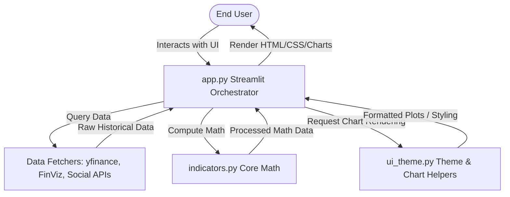

# System Architecture and Design

This document details the high-level architecture, directory layout, and runtime data flow of the **FAST Stock Analysis WebApp**.

## Architecture Overview

The application is built as a single-page or multi-view interactive web application utilizing **Streamlit** for the frontend rendering and controls, and Python for the scientific and mathematical computations.

## Component Breakdown

1. **Streamlit Orchestrator (`app.py`)**
   * Acts as the main entry point and controls the state machine of the application.
   * Manages layout columns, sidebar configurations, tabs, inputs, and interactive charts.
   * Directs calculation requests to `indicators.py` rather than performing inline technical indicators math.
   * Handles caching (`@st.cache_data` or `@st.cache_resource`) to speed up duplicate user queries and avoid hitting API rate limits.

2. **Design System & Styling (`ui_theme.py`)**
   * Encapsulates all color definitions, font preferences, custom CSS styling injection, and layout constants.
   * Standardizes chart styles (e.g. customized Plotly, Altair, or Matplotlib templates) to maintain consistent visual aesthetics (e.g., modern dark modes, custom grid lines).

3. **Core Indicator Calculations (`indicators.py`)**
   * Contain clean, tested, standalone Python implementations of technical analysis indicators (e.g. RSI, MACD, Stochastic Oscillator, ATR, Bollinger Bands).
   * Decoupled from Streamlit to allow clean unit testing and reuse in CLI scripts or other environments, fully integrated and consumed by `app.py`.

4. **Testing Suite (`tests/`)**
   * Includes unit test suites for verifying math calculations.
   * Run using the `pytest` runner.

## Data Flow Pipeline

1. **User Input Selection**: The user enters a stock ticker (e.g., `AAPL`), selects a date range, and specifies parameters for various technical indicators (e.g., RSI period, Bollinger Bands std dev).
2. **Data Ingestion**:
   * The app checks if cached data for the selected ticker/range exists.
   * If not, it requests historical OHLCV data from `yfinance` or news/screener metrics from `FinViz`.
3. **Indicator Calculation**: The raw dataframe is passed to functions in `indicators.py` to calculate technical indicator columns (like SMA, MACD line, signal line, etc.).
4. **Visual Rendering**:
   * The calculated values are sent to Plotly or Matplotlib graph rendering functions located in `ui_theme.py` to generate the interactive indicator charts.
   * Custom CSS styles are loaded and injected to make the application responsive and visually striking.
5. **Output Display**: The generated layout containing tables, sentiment scores, indicators, and charts is rendered on the client browser.
